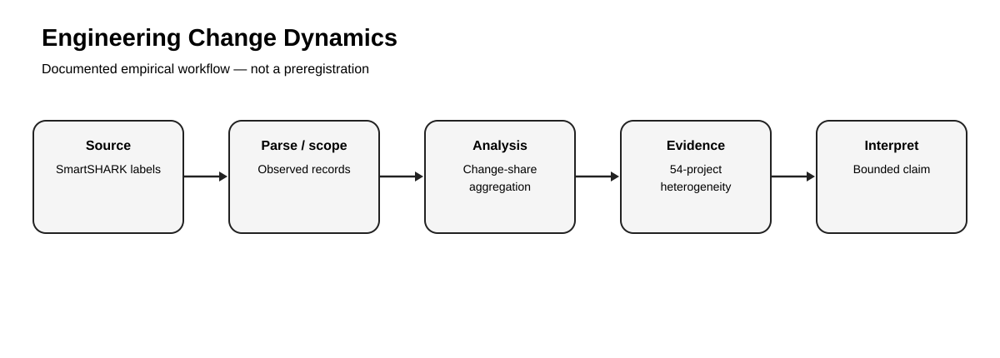
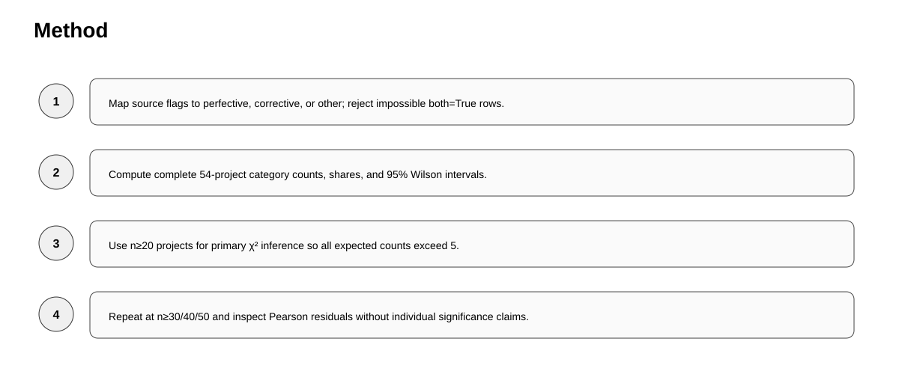
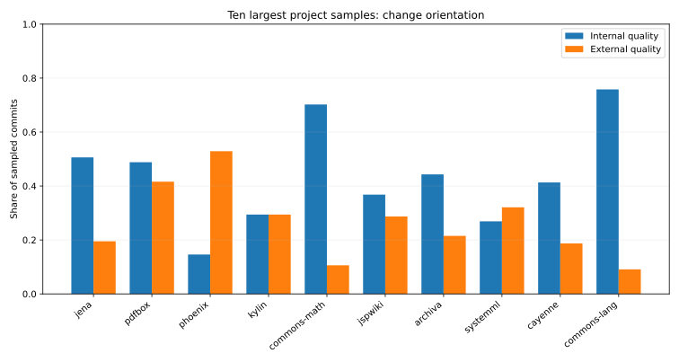
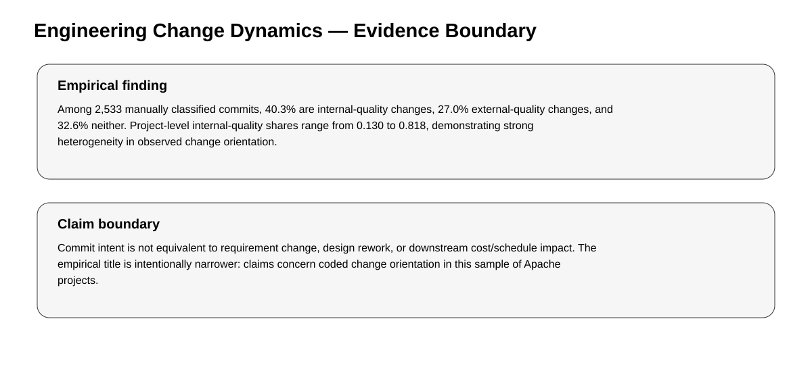

# Quality-Oriented Engineering Change Dynamics in Apache Projects

> **Empirical Research Bundle** · **Portfolio Track: Engineering Management Research** · Software-Intensive Systems / Engineering Change / Software Quality

Empirical analysis of 2,533 manually classified commits across 54 Apache projects to quantify engineering change orientation and project heterogeneity.



## Study status

**Completed secondary empirical analysis.** Reported findings were calculated from the named public source on 25 September 2026. The rebuild script contains **no synthetic fallback**. Raw source data are not republished unless source terms permit it; `data/source_manifest.json` records provenance, retrieval details, licensing notes, and the claim boundary.

## Research question

> How frequently do observed engineering changes target internal versus external software quality, and how heterogeneous is that orientation across projects?

## Design

- **Design:** Secondary observational analysis of 2,533 manually coded commits from 54 Java Apache projects
- **Source:** SmartSHARK commit-intent replication dataset (Trautsch et al.)
- **Source page:** https://zenodo.org/records/7078179
- **Direct data endpoint:** `https://zenodo.org/records/7078179/files/manual_labels.csv?download=1`
- **Retrieval / analysis date:** 2026-09-25
- **Licensing / reuse note:** Open Zenodo research dataset; cite the original authors and follow the record reuse terms.

## Hypotheses

1. H1: internal-quality changes constitute a substantial share of observed engineering work.
2. H2: project-level internal- and external-quality shares vary materially rather than following one portfolio-wide pattern.

## Empirical method

Parse the manually coded commit sample, classify each commit into internal-quality only, external-quality only, both, or neither, and compute overall and project-level shares. The packaged project table intentionally shows the ten projects with the largest sampled commit counts; portfolio extrema are computed over all 54 projects.



## Headline empirical finding

Among 2,533 manually classified commits, 40.3% are internal-quality changes, 27.0% external-quality changes, and 32.6% neither. Project-level internal-quality shares range from 0.130 to 0.818, demonstrating strong heterogeneity in observed change orientation.

### Headline metrics

- **n commits**: 2533
- **n projects**: 54
- **internal only**: 1022
- **external only**: 685
- **neither**: 826
- **both**: 0
- **internal only share**: 0.403
- **external only share**: 0.27
- **neither share**: 0.326
- **phi internal external**: -0.501
- **project internal share min**: 0.13
- **project internal share max**: 0.818
- **project external share min**: 0.0
- **project external share max**: 0.563

The packaged derived tables are documented in `docs/data_dictionary.md`. That document states explicitly whether each CSV is a complete analysis table or a diagnostic subset.



## What this study can and cannot claim

**Can claim:** the computations in this repository summarize the named public dataset under the documented operationalization.

**Cannot claim:** Commit intent is not equivalent to requirement change, design rework, or downstream cost/schedule impact. The empirical title is intentionally narrower: claims concern coded change orientation in this sample of Apache projects.



## Reproduce

Offline verification of packaged empirical results:

```bash
python -m pip install -r requirements.txt
pytest -q
python run_demo.py
```

Recompute the empirical analysis from the public source (internet required):

```bash
python scripts/fetch_and_analyze.py
```

The online rebuild calls study-specific functions from `research/model.py`; the tests exercise those functions and scientific invariants rather than only checking file presence.

## Research bundle contents

- `README.md` — study overview and bounded findings
- `EMPIRICAL_STUDY.md` — protocol, validity, and interpretation
- `data/source_manifest.json` — provenance, license note, and claim boundary
- `data/derived/` — compact derived empirical tables
- `results/empirical_summary.json` — machine-readable headline results
- `scripts/fetch_and_analyze.py` — public-source rebuild
- `research/model.py` — reusable study-specific analysis functions
- `tests/` — behavioral and scientific-invariant tests
- `docs/` — analysis plan, data dictionary, paper blueprint, references, originality map
- `assets/` — four study-specific SVG figures

## Research integrity

This bundle distinguishes **source data**, **operationalization**, **result**, and **interpretation**. The analysis plan documents the released analysis; it is **not described as preregistered**. Public data do not automatically validate a construct, so proxy and external-validity limits are explicit.
