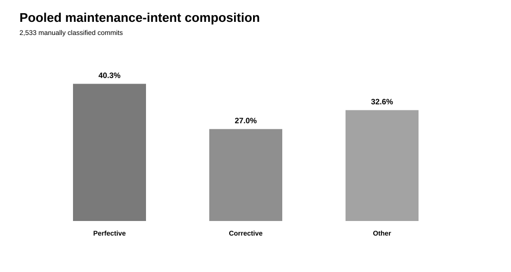
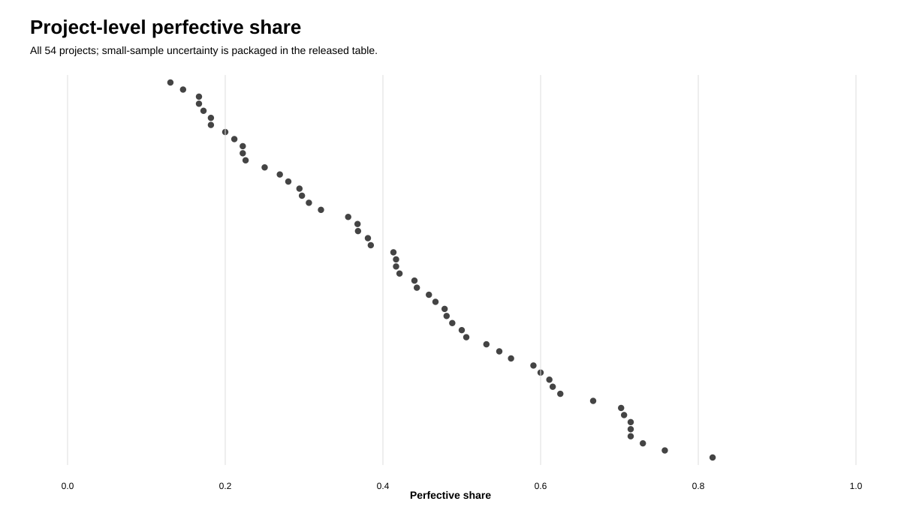
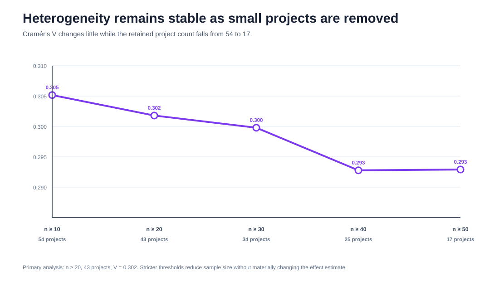

# Cross-Project Heterogeneity in Quality-Oriented Engineering Change

> **Empirical Research Bundle** · **Engineering Management Research** · Software Maintenance / Engineering Change / Empirical Software Engineering

A reproducible secondary analysis of **2,533 manually classified commits across 54 Apache Java projects**. The study focuses on how the composition of **perfective**, **corrective**, and **other** maintenance differs across projects, with uncertainty and sample-size sensitivity reported explicitly.


## Why this release is different

The prototype treated `internal_quality` and `external_quality` as independent binary variables and reported a phi coefficient. That was conceptually wrong for this source: the authors' ground truth is a three-category classification—**perfective, corrective, or other**—with perfective mapped to internal-quality intent and corrective mapped to external-quality intent. The released analysis now follows that taxonomy directly.

## Research questions

1. What share of manually classified commits are perfective, corrective, and other?
2. Does maintenance-intent composition vary across projects beyond sampling noise?
3. Is the estimated heterogeneity robust when small project samples are excluded?
4. Which project-category combinations depart most strongly from the pooled composition?

## Source and sampling

- **Dataset:** Trautsch, Erbel, Herbold & Grabowski replication data
- **Zenodo DOI:** `10.5281/zenodo.7078179`
- **File:** `manual_labels.csv`
- **Zenodo MD5:** `a099d942098227a1fc8127759e55850e`
- **Sample:** 2,533 commits from 54 Java Apache projects
- **Original study sampling:** approximately 2% of eligible commits per project, rounded up
- **Manual coding:** two researchers, consensus labels after resolving disagreements

The article reports the three-class scheme as **perfective, corrective, and other**. Perfective corresponds to internal-quality improvement intent; corrective corresponds to external-quality improvement intent.

## Pooled composition

| Category | Count | Share | 95% Wilson CI |
|---|---:|---:|---:|
| Perfective | 1,022 | 40.3% | 38.5–42.3% |
| Corrective | 685 | 27.0% | 25.3–28.8% |
| Other | 826 | 32.6% | 30.8–34.5% |



## Primary heterogeneity result

The complete 54-project table contains several small project samples, producing **21 expected cells below 5** in a standard 54×3 chi-square table. I therefore use projects with **n ≥ 20** as the primary inferential analysis.

For those **43 projects / 2,374 commits**:

- χ²(84) = **432.452175**
- p ≈ **2.46 × 10⁻⁴⁸**
- Cramér's V = **0.301796**
- minimum expected cell count = **5.794019**
- cells with expected count < 5 = **0**

This supports substantial cross-project heterogeneity in the observed maintenance-intent composition.



## Sample-size sensitivity

| Minimum project n | Projects | Commits | Cramér's V | Minimum expected |
|---:|---:|---:|---:|---:|
| 10 | 54 | 2,533 | 0.305165 | 2.704303 |
| 20 | 43 | 2,374 | 0.301796 | 5.794019 |
| 30 | 34 | 2,159 | 0.29979 | 8.364984 |
| 40 | 25 | 1,864 | 0.292777 | 11.630901 |
| 50 | 17 | 1,506 | 0.292908 | 13.977424 |

The effect size stays close to **0.30** across all thresholds, so the headline heterogeneity is not an artifact of only the smallest projects.



## Project-level evidence

All **54 projects** are packaged in `data/derived/project_composition.csv` with counts, shares, and category-specific Wilson intervals. The largest Pearson residuals relative to pooled composition include:

- **Phoenix / corrective:** +6.22
- **PDFBox / other:** −5.18
- **Phoenix / perfective:** −5.07
- **Commons Math / perfective:** +4.56
- **Commons Lang / perfective:** +4.53

These residuals identify the cells contributing strongly to heterogeneity; they are descriptive diagnostics, not individually multiplicity-adjusted hypothesis tests.

## What this study can claim

- the released sample contains 1,022 perfective, 685 corrective, and 826 other commits;
- maintenance-intent composition varies materially across the sampled Apache projects;
- the heterogeneity effect remains near V≈0.30 when increasingly small project samples are removed;
- project-level proportions carry wide uncertainty when n is small, which is visible in the packaged confidence intervals.

## What this study cannot claim

- commit intent is not requirement change, design rework, engineering-change cost, or schedule impact;
- the Apache sample does not represent all software organizations;
- project differences are descriptive associations, not causal effects;
- the manual ground truth should not be interpreted as two independent internal/external binary outcomes;
- the raw dataset license is not explicitly displayed in the Zenodo record, so this repository packages derived aggregates rather than redistributing the source CSV.


## Reproduce

Offline:

```bash
python -m pip install -r requirements.txt
pytest -q
python run_demo.py
python scripts/generate_figures.py --out-dir /tmp/change_figures
```

Public-source verification:

```bash
python scripts/fetch_and_analyze.py --check
```

The source rebuild verifies the Zenodo MD5, computes and prints SHA-256, reconstructs all 54 project tables, and checks the released summary and heterogeneity results.

## Research integrity

This analysis is **not preregistered**. The n≥20 inferential restriction is a released-analysis correction chosen to satisfy standard expected-cell guidance; n≥30/40/50 analyses are reported as sensitivity checks rather than hidden researcher degrees of freedom.
